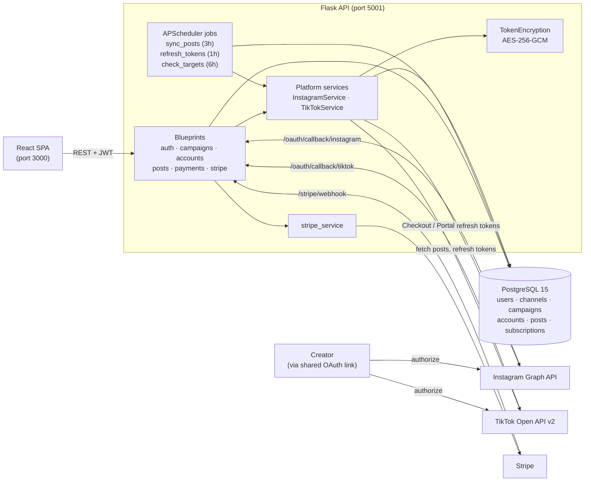

# Hookd Tracker

> A campaign tracking platform that lets brands connect creators' Instagram and TikTok accounts and monitor post performance against posting targets in one dashboard.

---

## Overview

Hookd Tracker is a full-stack campaign management web application designed to give brands and agencies a single place to run creator marketing campaigns, pull post metrics directly from the social platforms, and see whether each creator account is hitting its posting targets.

### Problem
* **The Challenge:** Brands running creator (UGC/influencer) campaigns across Instagram and TikTok usually track deliverables by hand: collecting post links, copying likes and views into spreadsheets, and chasing creators to check whether they posted enough.
* **The Impact:** Manual tracking is slow and error-prone, metrics go stale as soon as they are copied, and there is no reliable view of whether a campaign is on schedule.

### Solution & Key Metrics
Hookd Tracker addresses this issue by letting a company generate a shareable OAuth link per campaign. Once a creator authorizes their account, the backend stores the (encrypted) tokens, syncs posts and engagement metrics on a schedule, keeps tokens fresh, and checks each account's daily and monthly post counts against its targets.

* **🔗 2 platforms integrated:** Instagram (Graph API) and TikTok (Open API v2), behind a shared `PlatformService` interface.
* **🔌 22 REST endpoints** (auth, campaigns, accounts, posts, payments, Stripe webhook), with JWT auth and `admin` / `company` role checks.
* **⏱️ 3 scheduled background jobs:** post sync (every 3h), token refresh (every 1h), target check (every 6h), all configurable via env vars.
* **🔐 OAuth tokens encrypted at rest** with AES-256-GCM (`services/encryption.py`), used for every access/refresh token write and read.
* **💳 Stripe subscriptions:** Checkout, Customer Portal and a webhook that handles 5 event types across 6 database models.

---

## How It Works

Here is a high-level overview of the system architecture and data flow:



1. **Sign in:** a company (or admin) registers and logs in; the API returns a JWT that carries the user's role.
2. **Connect accounts:** from a campaign, the company requests `POST /campaigns/<id>/oauth-url` for Instagram or TikTok and shares the link with a creator. After the creator authorizes, the platform redirects to `/oauth/callback/<channel>`, the backend exchanges the code for tokens, encrypts them, creates the `Account`, and redirects the browser to `/oauth/success` or `/oauth/error`.
3. **Sync posts:** the `sync_posts` job (or a manual `POST /accounts/<id>/fetch-posts`) decrypts each account's token, pulls recent posts with likes, comments, views and shares, and upserts them by `platform_post_id`.
4. **Keep tokens alive:** `refresh_tokens` renews Instagram long-lived tokens with fewer than 7 days left and TikTok tokens with less than 1 hour left.
5. **Check targets:** `check_targets` counts each account's posts for the current day and month and logs a warning when an account is behind its `daily_target` or `monthly_target`.
6. **Billing:** the company picks a plan (starter or pro), is sent to Stripe Checkout, and the Stripe webhook creates or updates the `Subscription` record.

---

## Tech Stack

| Layer | Technology |
| --- | --- |
| Frontend | React 19, React Router 7, Recharts, CSS Modules (Create React App) |
| Backend | Python 3.11, Flask 3, Flask-SQLAlchemy, Flask-Migrate (Alembic), Flask-JWT-Extended, bcrypt |
| Background jobs | Flask-APScheduler (in-process, interval triggers) |
| Database | PostgreSQL 15 |
| Integrations | Instagram Graph API v19.0, TikTok Open API v2, Stripe |
| Security | JWT auth with role checks, AES-256-GCM token encryption (`cryptography`) |
| Local dev | Docker Compose (db, backend, frontend) |
| Infrastructure | Terraform for AWS (ECS Fargate, ECR, ALB, RDS PostgreSQL, Secrets Manager, CloudWatch Logs) |
| Testing | pytest / unittest |

---

## API Reference

All endpoints except auth, the OAuth callback and the Stripe webhook require a `Authorization: Bearer <JWT>` header.

**auth** (`/auth`)

| Method | Path | Description |
| --- | --- | --- |
| POST | `/auth/register` | Create a user (`admin` or `company`) |
| POST | `/auth/login` | Return a JWT access token and role |

**campaigns** (`/campaigns`)

| Method | Path | Description |
| --- | --- | --- |
| POST | `/campaigns` | Create a campaign |
| GET | `/campaigns` | List campaigns visible to the user |
| GET | `/campaigns/<id>` | Get one campaign |
| PUT | `/campaigns/<id>` | Update a campaign |
| DELETE | `/campaigns/<id>` | Delete a campaign |

**accounts**

| Method | Path | Description |
| --- | --- | --- |
| POST | `/campaigns/<id>/oauth-url` | Generate a shareable Instagram/TikTok OAuth URL |
| GET | `/oauth/callback/<channel>` | OAuth redirect target; creates the account |
| GET | `/campaigns/<id>/accounts` | List accounts linked to a campaign |
| GET | `/accounts` | List accounts (filters: `platform`, `campaign_id`) |
| DELETE | `/accounts/<id>` | Delete an account and its posts |
| POST | `/accounts/<id>/fetch-posts` | Trigger an immediate post sync |

**posts**

| Method | Path | Description |
| --- | --- | --- |
| GET | `/posts/<id>` | Get one post |
| GET | `/accounts/<id>/posts` | Posts for an account |
| GET | `/campaigns/<id>/posts` | Posts for a campaign (filter: `channel`) |
| GET | `/companies/<id>/posts` | Posts across a company's campaigns (filter: `channel`) |
| GET | `/channels/<id>/posts` | Posts for a channel |

**payments** and **stripe**

| Method | Path | Description |
| --- | --- | --- |
| GET | `/payments/subscription` | Current subscription status |
| POST | `/payments/create-checkout-session` | Start Stripe Checkout (`starter` or `pro`) |
| POST | `/payments/create-portal-session` | Open the Stripe Customer Portal |
| POST | `/stripe/webhook` | Stripe events: checkout completed, subscription created/updated/deleted, invoice payment failed |

---

## Getting Started

### Prerequisites

* Docker and Docker Compose
* (Optional) [ngrok](https://ngrok.com/) to receive OAuth callbacks locally
* Instagram (Meta) and TikTok developer apps, and a Stripe account, for the live integrations. See `plan/setup-instagram.md` and `plan/setup-tiktok.md`.

### Environment Variables

Create a `.env` file in the repo root (it is git-ignored). Docker Compose passes these to the backend:

| Variable | Purpose |
| --- | --- |
| `INSTAGRAM_APP_ID`, `INSTAGRAM_APP_SECRET` | Instagram / Meta app credentials |
| `TIKTOK_CLIENT_KEY`, `TIKTOK_CLIENT_SECRET` | TikTok app credentials |
| `OAUTH_REDIRECT_BASE_URL` | Public base URL for OAuth callbacks (default `http://localhost:5001`) |
| `TOKEN_ENCRYPTION_KEY` | Base64-encoded 32-byte key for token encryption |
| `STRIPE_SECRET_KEY`, `STRIPE_WEBHOOK_SECRET` | Stripe API and webhook signing secrets |
| `STRIPE_STARTER_PRICE_ID`, `STRIPE_PRO_PRICE_ID` | Stripe price IDs for each plan |
| `FRONTEND_URL` | Where the backend redirects after OAuth and Checkout (default `http://localhost:3000`) |

Optional backend settings: `JWT_SECRET_KEY` (set this outside local dev), `DATABASE_URL`, and `JOB_SYNC_POSTS_HOURS`, `JOB_REFRESH_TOKENS_HOURS`, `JOB_CHECK_TARGETS_HOURS`. The frontend reads `REACT_APP_API_URL` (default `http://localhost:5001`).

Generate an encryption key with:

```bash
python -c "import os, base64; print(base64.b64encode(os.urandom(32)).decode())"
```

### Start / Stop

```bash
# Build images + create containers + start containers
docker-compose up --build

# Build images + create containers + start containers (detached / background)
docker-compose up --build -d

# Stop containers + remove containers (volumes persist, DB data kept)
docker-compose down

# Stop containers + remove containers + remove volumes (DB data deleted)
docker-compose down -v
```

### View Logs

```bash
# Stream logs from all containers
docker-compose logs -f

# Stream logs from a specific container
docker-compose logs -f backend
docker-compose logs -f frontend
docker-compose logs -f db
```

### Access Containers

```bash
# Open a shell inside the backend container
docker-compose exec backend bash

# Open a shell inside the frontend container
docker-compose exec frontend bash

# Connect to PostgreSQL inside the db container
docker-compose exec db psql -U hookd -d hookd_tracker
```

### Database Migrations

```bash
# Run migrations inside the backend container
docker-compose exec backend flask db upgrade

# Generate a new migration file inside the backend container
docker-compose exec backend flask db migrate -m "description"

# Show migration history inside the backend container
docker-compose exec backend flask db history
```

### Rebuild Images

```bash
# Rebuild image for a specific service
docker-compose build backend
docker-compose build frontend

# Rebuild all images from scratch (no cache)
docker-compose build --no-cache
```

### Full Rebuild (reset DB + schema)

```bash
# Stop containers and delete all data (volumes)
docker compose down -v

# Remove old migration files
rm -rf backend/migrations/versions/*.py

# Build and start all containers
docker compose up -d --build

# Generate new migration from current models
docker compose exec backend flask db migrate -m "initial schema"

# Apply migration to database
docker compose exec backend flask db upgrade

# Populate with seed data
docker compose exec backend python seed.py
```

### Connect ngrok (for OAuth callbacks)

```bash
# Expose backend to the internet
ngrok http 5001

# Update .env with the ngrok URL
# OAUTH_REDIRECT_BASE_URL=https://xxxx.ngrok-free.app

# Restart backend to pick up new env
docker compose up -d backend

# Register the callback URL in Meta/TikTok Developer Console
# https://xxxx.ngrok-free.app/oauth/callback/instagram
# https://xxxx.ngrok-free.app/oauth/callback/tiktok
```

### Ports

| Service  | URL                   |
| -------- | --------------------- |
| Frontend | http://localhost:3000 |
| Backend  | http://localhost:5001 |
| Database | localhost:5432        |

### Seed Data

```bash
docker-compose exec backend python seed.py
```

The script is idempotent (safe to run multiple times; it skips existing records). It creates:

* The `instagram` and `tiktok` channels
* A company user, **Acme Brands**, with two campaigns: Summer Launch 2026 (Jun 1 to Aug 31, 2026) and Back to School 2026 (Aug 15 to Sep 15, 2026)
* An Instagram account (`@alexcreator_ig`) and a TikTok account (`@alexcreator_tt`) linked to each campaign
* 15 mock posts per account (60 in total) with randomized engagement metrics

Local test credentials created by the seed script:

| Role    | Email            | Password  |
| ------- | ---------------- | --------- |
| Company | company@test.com | Test1234! |

---

## Testing

The backend has 30 tests across 4 files, covering token encryption, the Instagram and TikTok services (with the platform APIs mocked), and the three scheduled jobs.

```bash
# Inside Docker (uses the Compose Postgres database)
docker-compose exec backend python -m pytest

# Or locally
cd backend
pip install -r requirements.txt
python -m pytest
```

`test_encryption.py` and `test_jobs.py` run on in-memory SQLite. The Instagram and TikTok service tests set their SQLite URI after the app is created, so they currently connect to the default Postgres URL and need the database running.

> **Current status:** with Postgres running, 27 of 30 tests pass. The two `test_handle_oauth_callback` tests and `test_refresh_token_refreshes_when_expiring` fail because the code and tests have drifted apart; fixing them is on the to-do list.

---

## Project Structure

```
hookd-tracker/
├── backend/
│   ├── app/
│   │   ├── __init__.py        # App factory: config, extensions, blueprints, scheduler
│   │   ├── models.py          # User, Channel, Campaign, Account, Post, Subscription
│   │   ├── routes/            # auth, campaigns, accounts, posts, payments (+ stripe webhook)
│   │   ├── services/          # PlatformService interface, Instagram, TikTok, Stripe, encryption
│   │   └── jobs/              # sync_posts, refresh_tokens, check_targets + scheduler setup
│   ├── migrations/            # Alembic migrations
│   ├── tests/                 # pytest suite
│   ├── seed.py                # Idempotent mock data
│   ├── requirements.txt
│   └── Dockerfile
├── frontend/
│   ├── src/
│   │   ├── pages/             # landing, auth, dashboard, campaigns, accounts, oauth, settings
│   │   ├── components/        # AppLayout, Sidebar, ProtectedRoute, Icons
│   │   ├── context/           # AuthContext (JWT storage)
│   │   └── utils/             # API client, constants, formatters
│   └── Dockerfile
├── infrastructure/            # Terraform for AWS (ECS, ECR, ALB, RDS, Secrets Manager)
├── plan/                      # Requirements, data schema, UI and platform setup notes
└── docker-compose.yml
```

The frontend has 13 implemented pages. The `/posts` and `/payroll` routes currently render a placeholder page.
